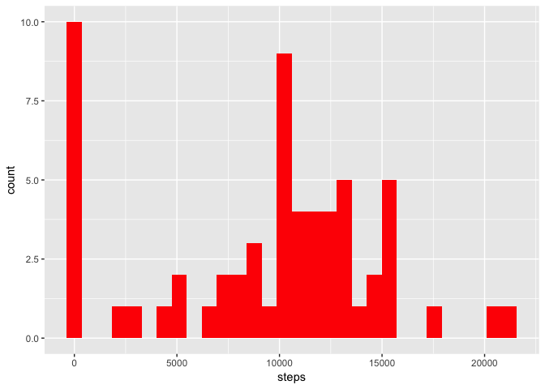
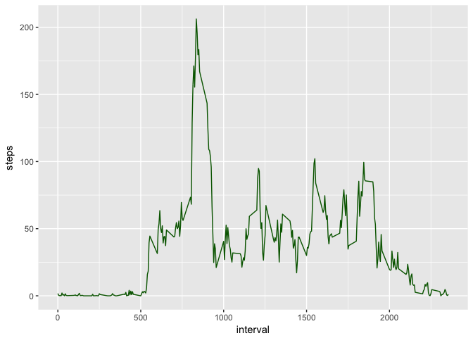
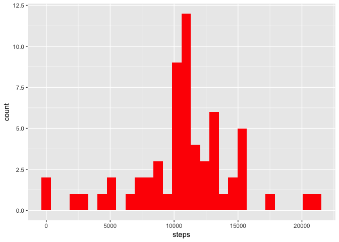
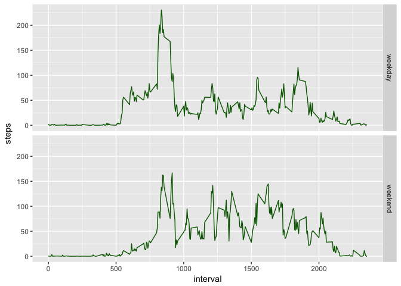

# Reproducible Research: Peer Assessment 1

## Loading and preprocessing the data

* Loading the needed libraries 

```r
library(dplyr) # for managing data 
```

```
## 
## Attaching package: 'dplyr'
```

```
## The following objects are masked from 'package:stats':
## 
##     filter, lag
```

```
## The following objects are masked from 'package:base':
## 
##     intersect, setdiff, setequal, union
```

```r
library(knitr) # for generating markdown and html files
library(ggplot2) # for drawing the plots
library(lubridate) # for managing dates
```

```
## 
## Attaching package: 'lubridate'
```

```
## The following object is masked from 'package:base':
## 
##     date
```

```r
activity <- read.csv("./activity.csv", header = TRUE)
```


## What is mean total number of steps taken per day?

* First of all, we need to group the data by date and sum the number of steps per day

```r
steps_day <- activity %>% group_by(date) %>% summarise(steps = sum(steps, na.rm =TRUE))
```

* Creating a histogram to explore the data

```r
p <- ggplot(steps_day, aes(steps))
p + geom_histogram(fill = "red", bins = 30)
```

<!-- -->

* Calculating the mean and the median for number of steps per day

```r
mean(steps_day$steps, na.rm = TRUE)
```

```
## [1] 9354.23
```

```r
median(steps_day$steps, na.rm = TRUE)
```

```
## [1] 10395
```


## What is the average daily activity pattern?
* In this case, we need to group the data by 5-minute interval, and do the mean of steps per interval

```r
steps_interval <- activity %>% group_by(interval) %>% summarise(steps = mean(steps, na.rm =TRUE))
```

* Drawing a time serial for each 5-minutes interval
* It seems the person gets up early (5:30 am) and do some exercise or go to work near 7:30am?
* Then he/she arrives at home near 6:00pm?

```r
p2 <- ggplot(steps_interval, aes(x = interval, y = steps))
p2 + geom_line(colour = "darkgreen")
```

<!-- -->

* Calculating the 5-minute interval which has the max value of steps

```r
steps_interval[which.max(steps_interval$steps),]$interval
```

```
## [1] 835
```


## Imputing missing values

* Calculating the number of NA in the dataset

```r
sum(is.na(activity$steps))
```

```
## [1] 2304
```

* Copyng the actual dataset

```r
activity_filled <- activity
```

* Imputing the NAs using the average 5-minute interval calculated before.
* We need to create a function to "translate" interval to average of steps.

```r
interval2steps <- function(interval) {
        steps_interval[steps_interval$interval == interval,]$steps
}

for (i in 1:nrow(activity_filled)) {
        if (is.na(activity_filled[i,]$steps)) {
                activity_filled[i,]$steps <- interval2steps(activity_filled[i,]$interval)  
        }
}
```

* Grouping the data by date again

```r
steps_filled_day <- activity_filled %>% group_by(date) %>% 
        summarise(steps = sum(steps, na.rm =TRUE))
```

* Drawing again the histogram and seeing differences...no NAs :-)

```r
p3 <- ggplot(steps_filled_day, aes(steps))
p3 + geom_histogram(fill = "red", bins = 30)
```

<!-- -->

* The new mean and median are different from the former ones.

```r
mean(steps_filled_day$steps, na.rm = TRUE)
```

```
## [1] 10766.19
```

```r
median(steps_filled_day$steps, na.rm = TRUE)
```

```
## [1] 10766.19
```


## Are there differences in activity patterns between weekdays and weekends?

* Creating a factor value (dummy variable) using wday() function --> 1 - Sunday, 7 - Saturday

```r
activity_filled$day <- ifelse(wday(as.Date(activity_filled$date)) %in% c(1,7), "weekend","weekday")
activity_filled$day <- factor(activity_filled$day,levels = c("weekday","weekend"))
```
* Grouping the data by 5-minute interval and type of day (weekday or weekend)

```r
steps_filled_interval <- activity_filled %>% group_by(interval,day) %>% summarise(steps = mean(steps, na.rm =TRUE))
```
* Using facets from ggplot2 library in order to see in the same picture both time series.
* As we can see, in the weekends there are less activity.

```r
p4 <- ggplot(steps_filled_interval, aes(x = interval, y = steps))
p4 <- p4 + geom_line(colour = "darkgreen")
p4 + facet_grid(facets = day ~ .)
```

<!-- -->
